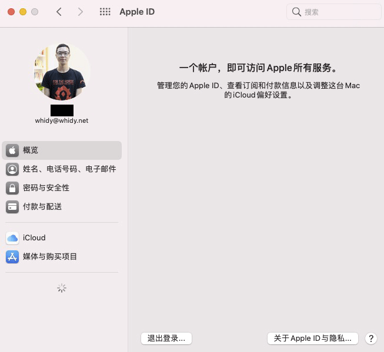

# ASUS-PRIME-X570-PRO-Hackintosh

> 基于 OpenCore0.7.8 的 X570 主机黑苹果配置分享。

* 官方教程：https://dortania.github.io/OpenCore-Install-Guide/prerequisites.html


## 电脑配置

* 主板：[华硕（ASUS）PRIME X570-PRO 主板](https://www.asus.com/Motherboards-Components/Motherboards/All-series/PRIME-X570-PRO/)
* CPU：AMD 锐龙 7 3700X
* 显卡：[华硕（ASUS）TUF Gaming 3 AMD Radeon RX 5600XT](https://www.asus.com/Motherboards-Components/Graphics-Cards/All-series/TUF-3-RX5600XT-O6G-EVO-GAMING/)
* SSD：Toshiba Q200EX（480G）

**没有单独安装无线网卡，仅能使用有线，目前 Monterey 不支持有线网卡，故不做升级**

BIOS：[Version 4021](https://www.asus.com/Motherboards-Components/Motherboards/All-series/PRIME-X570-PRO/HelpDesk_BIOS/)，更新于 2021/08/17。

## 其他说明

平台信息请按照教程[PlatformInfo](https://dortania.github.io/OpenCore-Install-Guide/AMD/zen.html#platforminfo)，自行修改，建议使用 `iMacPro1,1` 。也就是下面这部分：

```
<key>PlatformInfo</key>
<dict>
  <key>Automatic</key>
  <true/>
  <key>CustomMemory</key>
  <false/>
  <key>Generic</key>
  <dict>
    <key>AdviseFeatures</key>
    <false/>
    <key>MLB</key>
    <string>M0000000000000001</string>
    <key>MaxBIOSVersion</key>
    <false/>
    <key>ProcessorType</key>
    <integer>0</integer>
    <key>ROM</key>
    <data>ESIzRFVm</data>
    <key>SpoofVendor</key>
    <true/>
    <key>SystemMemoryStatus</key>
    <string>Auto</string>
    <key>SystemProductName</key>
    <string>iMacPro1,1</string>
    <key>SystemSerialNumber</key>
    <string>W00000000001</string>
    <key>SystemUUID</key>
    <string>00000000-0000-0000-0000-000000000000</string>
  </dict>
  <key>UpdateDataHub</key>
  <true/>
  <key>UpdateNVRAM</key>
  <true/>
  <key>UpdateSMBIOS</key>
  <true/>
  <key>UpdateSMBIOSMode</key>
  <string>Create</string>
  <key>UseRawUuidEncoding</key>
  <false/>
</dict>
```

修改好后可以正常登录，同步。



## 特别注意

* 当前分支`main`使用的是 release 版本的 opencore。请先使用另一分支的`debug`版本进行测试。
* 当前系统 `macOS Big Sur 11.5.2 (20G95)`，一直都是 OTA 升级，就目前来看没什么问题。
* 如果有内置硬盘被识别外置，请在`DeviceProperties`内的添加对应的`Device Path`，通过 hackintool 查看。我的 config 文件中添加了两个，作为示例。
* 如果你使用的是其他CPU，请查阅[AMD Vanilla OpenCore](https://github.com/AMD-OSX/AMD_Vanilla)进行调整。
* 如果你没有免驱 AMD 显卡，用的是 1070Ti，之前最高只支持 10xx 系列，只能安装 10.13.x，可参考我以前写的博文[AMD 黑苹果小记（Prime X570 Pro + Ryzen 3700X + 1070 Ti）](https://www.whidy.net/amd-hackintosh-note-with-asus-prime-x570-pro-ryzen-3700x-nvidia-1070ti)。

有其他问题可以提 issues，有空我会看看~

## 更新日志

最近对系统和 Opencore 进行了升级，做一点过程中遇到的问题记录。

### 2022 年 02 月 26 日

* 更新到 Opencore0.7.8
* ResizeGpuBars 启用，需要 BIOS 配合
* 升级后 `Hackintool` 内的引导工具版本检测错误则需要 reset nvram
* 硬盘如果被识别为外置，需要在`DeviceProperties`进行添加
