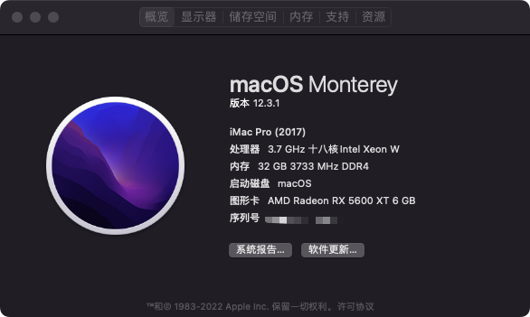

> 基于 OpenCore0.7.9 的 X570 主机黑苹果配置分享。

* 官方教程：https://dortania.github.io/OpenCore-Install-Guide/prerequisites.html



## 电脑配置

* 主板：[华硕（ASUS）PRIME X570-PRO 主板](https://www.asus.com/Motherboards-Components/Motherboards/All-series/PRIME-X570-PRO/)
* CPU：AMD 锐龙9 5900X
* 显卡：[华硕（ASUS）TUF Gaming 3 AMD Radeon RX 5600XT](https://www.asus.com/Motherboards-Components/Graphics-Cards/All-series/TUF-3-RX5600XT-O6G-EVO-GAMING/)
* WIFI：AX210（PCIE）
* 西部数码 SN750（512G）

BIOS：[Version 4204](https://www.asus.com/Motherboards-Components/Motherboards/All-series/PRIME-X570-PRO/HelpDesk_BIOS/)，更新于 `2022/03/07` 。

## 其他说明

平台信息请按照教程[PlatformInfo](https://dortania.github.io/OpenCore-Install-Guide/AMD/zen.html#platforminfo)，自行修改，建议使用 `iMacPro1,1` 。也就是下面这部分：

```
<key>PlatformInfo</key>
<dict>
  <key>Automatic</key>
  <true/>
  <key>CustomMemory</key>
  <false/>
  <key>Generic</key>
  <dict>
    <key>AdviseFeatures</key>
    <false/>
    <key>MLB</key>
    <string>M0000000000000001</string>
    <key>MaxBIOSVersion</key>
    <false/>
    <key>ProcessorType</key>
    <integer>0</integer>
    <key>ROM</key>
    <data>ESIzRFVm</data>
    <key>SpoofVendor</key>
    <true/>
    <key>SystemMemoryStatus</key>
    <string>Auto</string>
    <key>SystemProductName</key>
    <string>iMacPro1,1</string>
    <key>SystemSerialNumber</key>
    <string>W00000000001</string>
    <key>SystemUUID</key>
    <string>00000000-0000-0000-0000-000000000000</string>
  </dict>
  <key>UpdateDataHub</key>
  <true/>
  <key>UpdateNVRAM</key>
  <true/>
  <key>UpdateSMBIOS</key>
  <true/>
  <key>UpdateSMBIOSMode</key>
  <string>Create</string>
  <key>UseRawUuidEncoding</key>
  <false/>
</dict>
```

修改好后可以正常登录，同步iCloud。

* 当前分支`monterey-5900x-0.7.9`使用的是 debug 版本的 opencore。
* 当前系统 `macOS Monterey 12.3.1`。
* 如果有内置硬盘被识别外置，请在`DeviceProperties`内的添加对应的`Device Path`，通过 hackintool 查看。我的 config 文件中添加了两个，作为示例。
* 如果CPU不同请参考[Kernel patches](https://github.com/AMD-OSX/AMD_Vanilla/tree/master)
* 如果你没有免驱 AMD 显卡，用的是 1070Ti，之前最高只支持 10xx 系列，只能安装 10.13.x，可参考我以前写的博文[AMD 黑苹果小记（Prime X570 Pro + Ryzen 3700X + 1070 Ti）](https://www.whidy.net/amd-hackintosh-note-with-asus-prime-x570-pro-ryzen-3700x-nvidia-1070ti)。
* 本次相对[opencore 0.7.8的Big Sur配置](https://github.com/whidy/ASUS-PRIME-X570-PRO-Hackintosh/releases/tag/opencore-0.7.8-for-big-sur-v1.0.0)添加了amd的CPU工具包。

## 特别说明

> 目前不能工作的仅有蓝牙功能，因为AX210在Monterey下支持还没找到方案，如果使用有线网络，是非常完美的。

* 安装系统时，无线网络似乎不起作用，所以还是需要有线网络安装及系统配置。
* 目前AX210在Monterey下无解，我在远景发了个帖子并保持追踪：[AX210蓝牙目前应该是无解的【2022年04月11日】](https://bbs.pcbeta.com/viewthread-1927546-1-2.html)
* 如果配置大体相同的情况下，你基本上只需要更换 `PlatformInfo` 的内容就可以了，但是如果还是无法进入安装界面，是不是你的BIOS设置没有做好呢？再来看看[AMD BIOS Settings](https://dortania.github.io/OpenCore-Install-Guide/AMD/zen.html#amd-bios-settings)仔细对比下吧~
* 暂时不专门更新一个release版本的opencore了，因为将debug版本更换为release版本很容易，去下载release版的包，并替换掉debug版的 `*.efi` （直接覆盖就行），再去根据文档[Disabling all logging](https://dortania.github.io/OpenCore-Install-Guide/troubleshooting/debug.html#config-changes)来修改 `config.plist` 几个地方就好了，还有 `boot-args` 根据需要修改。当然你自己更换release前，必定是确认debug版本没有问题啦。

如果确认都没有什么操作上的问题，还是不行，可以提 issues，有空我会看看~
