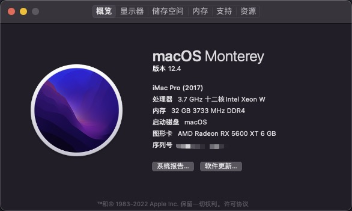

> 基于 OpenCore0.8.1 的 X570 主机黑苹果配置分享，或许支持macOS 13，但未验证。

* 官方教程：https://dortania.github.io/OpenCore-Install-Guide/prerequisites.html



## 电脑配置

* 主板：[华硕（ASUS）PRIME X570-PRO 主板](https://www.asus.com/Motherboards-Components/Motherboards/All-series/PRIME-X570-PRO/)
* CPU：AMD 锐龙 9 5900X
* 显卡：[华硕（ASUS）TUF Gaming 3 AMD Radeon RX 5600XT](https://www.asus.com/Motherboards-Components/Graphics-Cards/All-series/TUF-3-RX5600XT-O6G-EVO-GAMING/)
* WIFI：AX210（PCIE）
* 西部数码 SN750（512G）

BIOS：[Version 4403](https://www.asus.com/Motherboards-Components/Motherboards/All-series/PRIME-X570-PRO/HelpDesk_BIOS/)，更新于 `2022/05/31` 。

## 其他说明

平台信息请按照教程[PlatformInfo](https://dortania.github.io/OpenCore-Install-Guide/AMD/zen.html#platforminfo)，自行修改，建议使用 `iMacPro1,1` 。也就是下面这部分：

```
<key>PlatformInfo</key>
<dict>
  <key>Automatic</key>
  <true/>
  <key>CustomMemory</key>
  <false/>
  <key>Generic</key>
  <dict>
    <key>AdviseFeatures</key>
    <false/>
    <key>MLB</key>
    <string>M0000000000000001</string>
    <key>MaxBIOSVersion</key>
    <false/>
    <key>ProcessorType</key>
    <integer>0</integer>
    <key>ROM</key>
    <data>ESIzRFVm</data>
    <key>SpoofVendor</key>
    <true/>
    <key>SystemMemoryStatus</key>
    <string>Auto</string>
    <key>SystemProductName</key>
    <string>iMacPro1,1</string>
    <key>SystemSerialNumber</key>
    <string>W00000000001</string>
    <key>SystemUUID</key>
    <string>00000000-0000-0000-0000-000000000000</string>
  </dict>
  <key>UpdateDataHub</key>
  <true/>
  <key>UpdateNVRAM</key>
  <true/>
  <key>UpdateSMBIOS</key>
  <true/>
  <key>UpdateSMBIOSMode</key>
  <string>Create</string>
  <key>UseRawUuidEncoding</key>
  <false/>
</dict>
```

修改好后可以正常登录，同步 iCloud。

* 当前分支 `monterey-5900x-0.8.1` 使用的是 debug 版本的 opencore（**基于 `monterey-5900x-0.7.9` 升级**）；
* 当前系统 `macOS Monterey 12.4` ；
* 已经升级了最新的 `AMD Patch` ；

## 特别说明

> 目前不能工作的仅有蓝牙功能，因为 AX210 在 Monterey 下支持还没找到方案，如果使用有线网络，是非常完美的。

* 安装系统时，无线网络似乎不起作用，所以还是需要有线网络安装及系统配置。
* 目前 AX210 在 Monterey 下无解，我在远景发了个帖子并保持追踪：[AX210 蓝牙目前应该是无解的【2022 年 04 月 11 日】](https://bbs.pcbeta.com/viewthread-1927546-1-2.html)
* 如果配置大体相同的情况下，你基本上只需要更换 `PlatformInfo` 的内容就可以了，但是如果还是无法进入安装界面，是不是你的 BIOS 设置没有做好呢？再来看看[AMD BIOS Settings](https://dortania.github.io/OpenCore-Install-Guide/AMD/zen.html#amd-bios-settings)仔细对比下吧~
* 暂时不专门更新一个 release 版本的 opencore 了，因为将 debug 版本更换为 release 版本很容易，去下载 release 版的包，并替换掉 debug 版的 `*.efi` （直接覆盖就行），再去根据文档[Disabling all logging](https://dortania.github.io/OpenCore-Install-Guide/troubleshooting/debug.html#config-changes)来修改 `config.plist` 几个地方就好了，还有 `boot-args` 根据需要修改。当然你自己更换 release 前，必定是确认 debug 版本没有问题啦。

如果确认都没有什么操作上的问题，还是不行，可以提 issues，有空我会看看~
